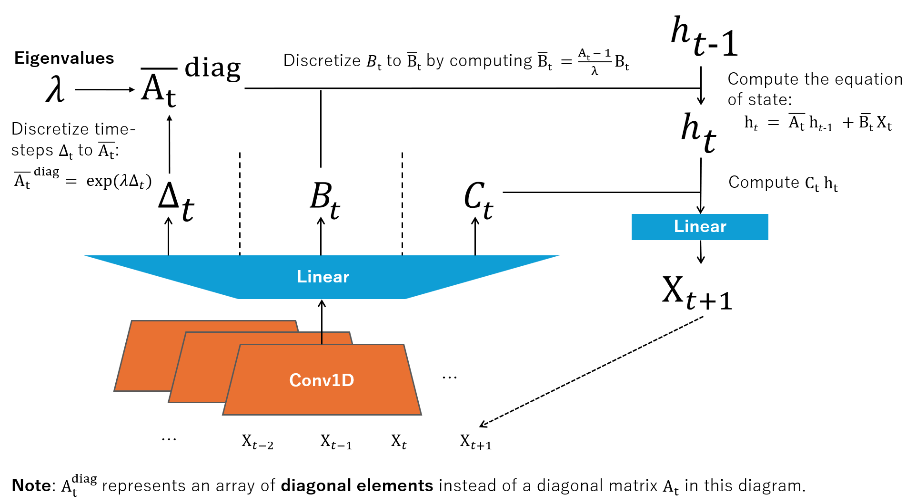

# mamba-lm
A minimal implementation of Mamba in PyTorch and huggingface libraries.

## Architecture Diagram

## Experiments
The loss curve from an experiment using artificial data:

# References

* Albert Gu and Tri Dao. "Mamba: Linear-time sequence modeling with selective state spaces." arXiv preprint arXiv:2312.00752 (2023).
* An official implementation (highly optimized): https://github.com/state-spaces/mamba
